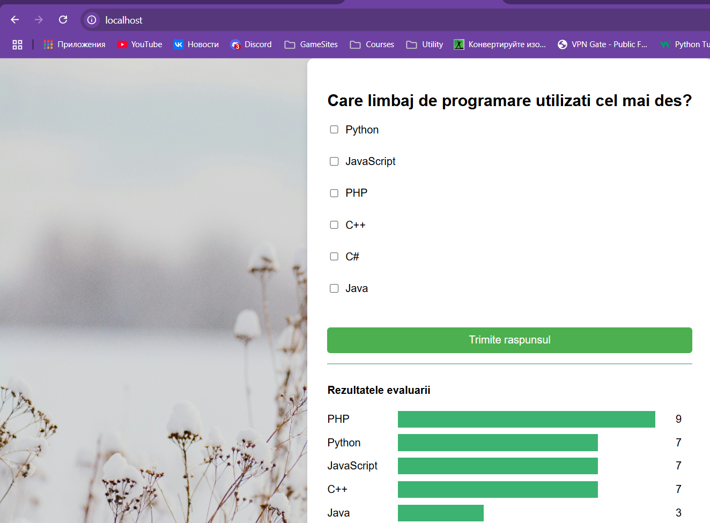
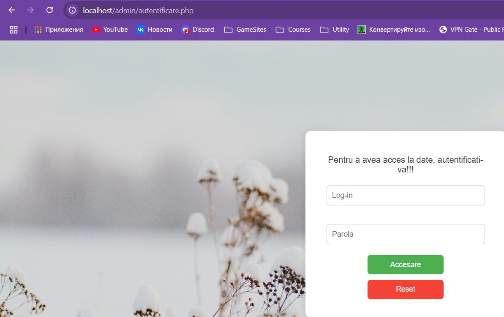
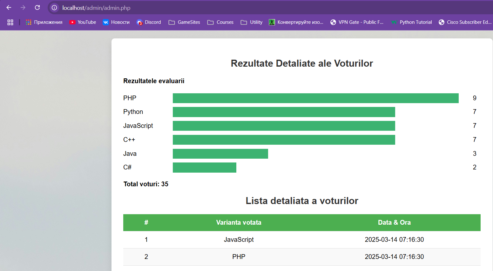

# Interacțiunea containerelor

## Scopul: Gestionarea interactiunii intre mai multe containere

### Sarcina propusa: Creați o aplicație PHP pe baza a două containere: nginx, php-fpm

### Mod de lucru

1. Cream un director *mounts/sites* in care includem fisierele unui site PHP creat de noi

2. Cream fisierul *.gitignore* si adaugam in el urmatorul continut:

    ```shell
    # Ignore files and directories
    mounts/site/*
    ```

3. Cream directorul *nginx*  iar in el un fisier *default.conf* cu urmatorul continut:

    ```shell
    server {
        listen 80;
        server_name _;
        root /var/www/html;
        index index.php;
        location / {
            try_files $uri $uri/ /index.php?$args;
            }
        location ~ \.php$ {
            fastcgi_pass backend:9000;
            fastcgi_index index.php;
            fastcgi_param SCRIPT_FILENAME $document_root$fastcgi_script_name;
            include fastcgi_params;
        }
    }
    ```

4. Cream reteaua *internal* pentru containere prin comanda:

    ```shell
    docker network create internal
    ```

5. Se da conditia **Creați containerul backend cu următoarele proprietăți:**

    - pe baza imaginii php:7.4-fpm;
    - directorul mounts/site este montat în /var/www/html
    - funcționează în rețeaua internal

    Realizam aceasta sarcina utilizand comanda de mai jos

    ```shell
    docker run -d --name backend --network internal -v "%cd%/mounts/site:/var/www/html" php:7.4-fpm
    ```

6. Se da urmatoarea sarcina **Creați containerul frontend cu următoarele proprietăți:**

    - pe baza imaginii nginx:1.23-alpine;
    - directorul mounts/site este montat în /var/www/html;
    - fișierul nginx/default.conf este montat în /etc/nginx/conf.d/default.conf;
    - portul 80 al containerului este expus pe portul 80 al calculatorului gazdei;
    - funcționează în rețeaua internal

    Realizam sarcina aceasta prin comanda de mai jos

    ```shell
    docker run -d --name frontend --network internal -v "%cd%/mounts/site:/var/www/html" -v "%cd%/nginx/default.conf:/etc/nginx/conf.d/default.conf" -p 80:80 nginx:1.23-alpine
    ```

    **Remarca:** Utilizam *%cd%* in comenzile *docker run* deoarece Windows cere cai absolute sa fie folosite la volume in Docker

7. Verificam ca containerele sa fie pornite si sa nu fie erori in *Logs*, iar apoi verificam rezultatul accesand *localhost* in broser-ul nostru

    

    Incercam sa accesam pagina admin\admin.php, dar vom fi redirectionati la autentificare deoarece nu exista sesiune a adminului

    

    Introducem login-ul: admin si parola: password pentru a accesa pagina de admin

    

### Intrebari

1. În ce mod în acest exemplu containerele pot interacționa unul cu celălalt?

    - Ele pot comunica datorita retelei internal care a fost creata. In fisierul default.conf avem linia **fastcgi_pass backend:9000;** din care vedem ca se face trimitere la celalat container al nostru - containerul PHP cu numele backend

2. Cum văd containerele unul pe celălalt în cadrul rețelei internal?

    - Docker ofera un sistem de DNS pentru containerele care se afla in aceeasi retea, in cazul nostru internal. Ele comunica intre ele utilizand numele lor

3. De ce a fost necesar să se suprascrie configurarea nginx?

    - Imaginea oficiala *nginx:1.23-alpine* vine cu un fisier de configurare implicit, deci el nu va putea accesa fisiere index.php, deaoerece el va vedea doar cele HTML, plus la asta anume in acel fisier noi specificam ca exista un alt container cu numele *backend* la care se poate de conectat

## Concluzie

In urma acestei lucrari am putut monta un site de pe host in docker containere pentru a putea sa le accesam pe portul 80 (localhost). Spre deosebire de lucrarea precedenta noi am creat 2 containere, unul cu **PHP**, iar altul cu **ngnix** ceea ce e cu mult mai usor si mai corect decat sa cream un singur container cu toate serviciile necesare, am creat o retea prin intermediul careia containerele pot sa interactioneze intre ele, ceea ce e si posibil atat din cauza existentei retelei, cat si din cauza fisierului nostru de configurare in directorul *nginx\default.conf*. La urma efectuand pasii expusi in modul de lucru corect am putut accesa o aplicatie care a fost preluata dintr-un director de pe host care a fost montata in container
